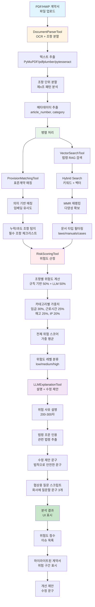

# LLM Toolchain 아키텍처

Linkus Legal은 단순한 프롬프트 엔지니어링이 아닌, **명확한 입력/출력을 가진 독립적인 도구들의 체인**으로 구성되어 있습니다.

## 📑 목차

1. [도구 구성](#도구-구성)
2. [파이프라인 아키텍처](#파이프라인-아키텍처)
3. [파이프라인 실행 흐름](#파이프라인-실행-흐름)
4. [도구 체인의 장점](#도구-체인의-장점)

---

## 도구 구성

### 1. DocumentParserTool
**역할**: OCR + 조항 기준 청킹 + 조항 번호 패턴 분석

- PDF/HWP/HWPX 파일에서 텍스트 추출 (PyMuPDF, pdfplumber, pytesseract)
- 제n조 패턴 기반 조항 단위 자동 분할
- 조항 번호/패턴 분석 (제n조, 제n장, 제n절 등)
- 메타데이터 추출 (페이지 수, 문자 수 등)

**구현 위치**: `backend/core/tools/document_parser_tool.py`

---

### 2. ProvisionMatchingTool
**역할**: 표준 근로계약과 의미기반 매칭, 누락/과도 조항 감지

- 표준 근로계약서 템플릿과 의미 기반 매칭 (임베딩 유사도)
- 필수 조항 누락 탐지 (체크리스트 기반)
- 불필요한 과도 조항 식별
- 매칭 점수 계산 및 분류

**구현 위치**: `backend/core/tools/provision_matching_tool.py`

---

### 3. VectorSearchTool (Legal Retriever)
**역할**: 법령/표준계약/매뉴얼 Hybrid Search + MMR

- 벡터 검색 (의미 기반 유사도)
- Hybrid Search (키워드 + 벡터 가중치 조합)
- MMR 재랭킹 (중복 제거, 다양성 확보)
- 문서 타입별 필터링 (laws/manuals/standard_contracts/cases)

**구현 위치**: `backend/core/tools/vector_search_tool.py`

---

### 4. RiskScoringTool
**역할**: 조항별 위험도 + 전체 스코어 계산

- 조항별 위험도 산정 (규칙 기반 50% + LLM 기반 50%)
- 카테고리별 가중치 적용 (임금 30%, 근로시간 25%, 해고 25%, IP 20%)
- 전체 위험 스코어 계산 (가중 평균)
- 위험도 레벨 분류 (low/medium/high)

**구현 위치**: `backend/core/tools/risk_scoring_tool.py`

---

### 5. LLMExplanationTool
**역할**: 자연어 설명 + 법조문 인용 + 수정 제안

- 위험 사유 자연어 설명 생성 (200-300자)
- 관련 법령 조문 자동 추출 및 인용
- 수정 제안 문구 생성
- 협상용 질문 스크립트 생성 (회사에 질문할 문구 3개)

**구현 위치**: `backend/core/tools/llm_explanation_tool.py`

---

## 파이프라인 아키텍처

---

## 파이프라인 실행 흐름

1. **문서 파싱**: PDF/HWP → 텍스트 추출 → 조항 단위 분할
2. **조항 매칭**: 표준 계약서와 의미 기반 매칭 → 누락/과도 조항 탐지
3. **법령 검색**: Hybrid Search + MMR로 관련 법령/조문 검색
4. **위험도 산정**: 조항별 위험도 계산 → 전체 스코어 산출
5. **설명 생성**: 위험 조항에 대한 자연어 설명, 법조문 인용, 수정 제안 생성
6. **결과 반환**: 구조화된 분석 결과를 UI에 전달

---

## 도구 체인의 장점

- **모듈화**: 각 도구가 독립적으로 테스트 및 수정 가능
- **재사용성**: 다른 분석 파이프라인에서도 도구 재사용 가능
- **확장성**: 새로운 도구 추가가 용이 (BaseTool 상속)
- **투명성**: 각 단계의 입력/출력이 명확하여 디버깅 용이
- **검증 가능성**: 각 도구의 결과를 중간 단계에서 검증 가능

**이것이 단순한 "LLM 프롬프트"가 아닌 "엔지니어링된 툴 체인"인 이유입니다.**

---

## 추가 정보

- 환각 줄이기 전략: [HALLUCINATION_REDUCTION.md](./HALLUCINATION_REDUCTION.md)
- Legal RAG 가이드: [LEGAL_RAG_GUIDE.md](./LEGAL_RAG_GUIDE.md)

