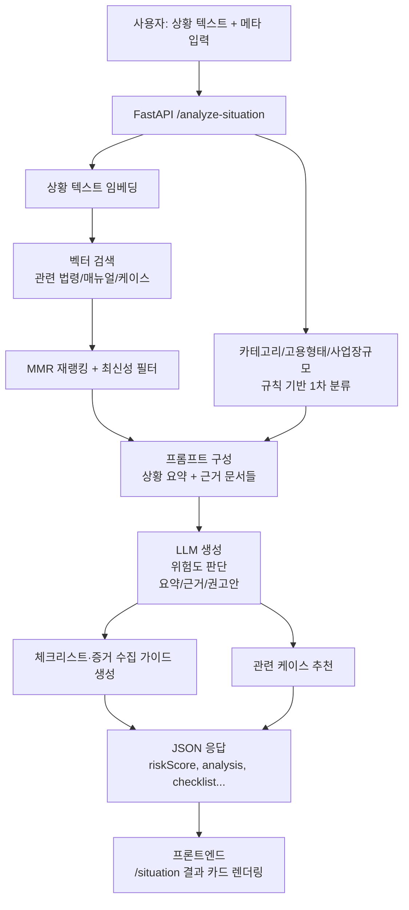

# 법률 서비스 백엔드 구현 가이드

> 해커톤 심사 및 백엔드 개발자를 위한 완전한 구현 패키지

이 문서는 프론트엔드와 백엔드 간의 API 명세, FastAPI 코드 템플릿, 데이터베이스 스키마, RAG 플로우, LLM 프롬프트를 포함한 종합 구현 가이드입니다.

---

## 📋 목차

1. [프론트 ↔ 백엔드 API 명세](#1-프론트--백엔드-api-명세)
2. [FastAPI 코드 템플릿](#2-fastapi-코드-템플릿)
3. [DB 테이블 생성 SQL](#3-db-테이블-생성-sql)
4. [RAG 전체 플로우 다이어그램](#4-rag-전체-플로우-다이어그램)
5. [LLM 프롬프트 전문](#5-llm-프롬프트-전문)

---

## 1. 프론트 ↔ 백엔드 API 명세

### 1-1. 공통

**Base URL (로컬)**: `http://localhost:8000`  
**Base URL (배포)**: `.env`의 `NEXT_PUBLIC_BACKEND_API_URL`

프론트에서 공통적으로 사용할 설정:

```typescript
const API_BASE = process.env.NEXT_PUBLIC_BACKEND_API_URL ?? 'http://localhost:8000';
```

### 1-2. 헬스 체크

**Endpoint**: `GET /api/health`

**사용 화면**: 없음 (개발/배포 확인용)

**Response 예시**:
```json
{
  "status": "ok",
  "message": "Linkus Public RAG API is running"
}
```

### 1-3. 계약서 분석 (파일 업로드)

**Endpoint**: `POST /api/v2/legal/analyze-contract`

**Method**: `multipart/form-data`

**사용 화면**:
- `/legal/contract` 업로드 후
- `/legal/contract/[docId]` 분석 결과

**Request**:

| 필드 | 타입 | 필수 | 설명 |
|------|------|------|------|
| `file` | File | ✅ | PDF/HWPX 등 계약서 파일 |
| `title` | string | ❌ | 문서 이름 (없으면 파일명) |
| `doc_type` | string | ❌ | "employment", "freelance" 등 |

**Response (예시 스키마)**:
```json
{
  "docId": "c5f9b5e0-1234-4cde-9f01-abcdef123456",
  "title": "2025년 입사 근로계약서",
  "riskScore": 72.5,
  "riskLevel": "high",
  "sections": {
    "working_hours": 80,
    "wage": 70,
    "probation_termination": 90,
    "stock_option_ip": 40
  },
  "issues": [
    {
      "id": "issue-1",
      "category": "working_hours",
      "severity": "high",
      "summary": "주 60시간 근로 + 연장수당 미지급 위험",
      "originalText": "근로시간은 주 60시간으로 하며, 연장·야간·휴일근로수당은 기본급에 포함된 것으로 한다.",
      "legalBasis": [
        "근로기준법 제50조(근로시간)",
        "근로기준법 제56조(연장·야간 및 휴일근로)"
      ],
      "explanation": "연장·야간·휴일근로수당을 일괄 포함하는 포괄임금제는...",
      "suggestedRevision": "연장·야간·휴일근로가 발생하는 경우 근로기준법 제56조에 따라 별도의 수당을 지급한다."
    }
  ],
  "summary": "이 계약서는 근로시간 및 포괄임금제와 관련된 위험이 높습니다...",
  "retrievedContexts": [
    {
      "sourceType": "law",
      "title": "근로기준법 제50조(근로시간)",
      "snippet": "1주간의 근로시간은 휴게시간을 제외하고 40시간을 초과할 수 없다."
    }
  ],
  "createdAt": "2025-11-17T10:20:00Z"
}
```

프론트에서는 `docId`를 URL 파라미터로 사용:
- `/legal/contract/[docId]` → 이 `docId` 기준으로 상태 관리 or DB 조회

### 1-4. 계약서 상세 조회 (옵션)

**Endpoint**: `GET /api/v2/legal/contracts/{doc_id}`

**사용 화면**: `/legal/contract/[docId]` 새로고침 시

**Response**: 위 `analyze-contract` 응답과 동일 구조

### 1-5. 상황별 법률 분석

**Endpoint**: `POST /api/v2/legal/analyze-situation`

**Method**: `application/json`

**사용 화면**: `/legal/situation`

**Request**:
```json
{
  "situation": "수습 2개월 차에 해고 통보를 받았습니다. 사전 예고는 없었고...",
  "category": "probation",
  "employmentType": "intern",
  "companySize": "under5",
  "workPeriod": "under_3_months",
  "hasWrittenContract": true,
  "socialInsurance": ["employment", "health"]
}
```

**Response**:
```json
{
  "riskScore": 78,
  "riskLevel": "high",
  "tags": ["수습기간", "해고 예고", "근로계약서"],
  "analysis": {
    "summary": "수습기간 중이라도 해고에는 정당한 이유와 절차가 필요합니다...",
    "legalBasis": [
      {
        "title": "근로기준법 제27조(해고의 서면통지)",
        "snippet": "사용자는 근로자를 해고하려면 그 이유와 시기를 서면으로 통지하여야 한다.",
        "sourceType": "law"
      }
    ],
    "recommendations": [
      "해고 통보를 문자, 메신저 등으로 다시 한번 받도록 요청해 기록을 남기세요.",
      "회사에 해고 사유와 기준을 서면으로 요구하세요.",
      "관할 고용노동청(1350)에 상담을 신청해 보세요."
    ]
  },
  "checklist": [
    "근로계약서 또는 오퍼레터를 다시 확인하고 스크린샷/사본을 확보합니다.",
    "해고 통보가 언제, 어떤 방식으로 이루어졌는지 기록합니다.",
    "수습기간, 평가 기준, 정규직 전환 기준이 문서에 있는지 확인합니다."
  ],
  "relatedCases": [
    {
      "id": "case-123",
      "title": "수습 2개월 차 부당해고 사례",
      "summary": "평가 기준이 명확하지 않은 상태에서...",
      "link": null
    }
  ]
}
```

### 1-6. 법령/케이스 검색

**Endpoint**: `GET /api/v2/legal/search`

**Query Params**:

| 이름 | 예시 | 설명 |
|------|------|------|
| `q` | `근로시간` | 검색어 |
| `limit` | `5` | 개수 |
| `doc_type` | `law` | `law`, `standard_contract`, `manual`, `case` |
| `source_type` | `["moel","mss"]` | (옵션) |

**Response**:
```json
{
  "results": [
    {
      "legal_document_id": "doc_123",
      "section_title": "제50조(근로시간)",
      "text": "1주간의 근로시간은 휴게시간을 제외하고 40시간을 초과할 수 없다.",
      "score": 0.95,
      "source": "moel",
      "doc_type": "law",
      "title": "근로기준법"
    }
  ],
  "count": 1,
  "query": "근로시간"
}
```

---

## 2. FastAPI 코드 템플릿

### 2-1. 기본 구조

```
backend/
  app/
    main.py
    api/
      __init__.py
      legal_rag.py          # 법률 서비스 라우터
    services/
      legal_rag_service.py   # RAG 서비스 로직
      ocr_service.py         # OCR 처리
      analysis_service.py    # 분석 로직
    db/
      session.py             # DB 세션
      models.py              # SQLAlchemy 모델
      schemas.py             # Pydantic 스키마
```

### 2-2. main.py

```python
from fastapi import FastAPI
from fastapi.middleware.cors import CORSMiddleware
from api.legal_rag import router as legal_router

app = FastAPI(title="Linkus Legal API")

origins = [
    "http://localhost:3000",
    "https://your-app.vercel.app",
]

app.add_middleware(
    CORSMiddleware,
    allow_origins=origins,
    allow_credentials=True,
    allow_methods=["*"],
    allow_headers=["*"],
)

@app.get("/api/health")
async def health():
    return {"status": "ok", "message": "Linkus Public RAG API is running"}

app.include_router(legal_router)
```

### 2-3. Pydantic 스키마 (schemas.py)

```python
from pydantic import BaseModel, Field
from typing import List, Optional, Literal, Dict, Any

# 법률 검색 결과
class LegalSearchResult(BaseModel):
    legal_document_id: str
    section_title: Optional[str]
    text: str
    score: float
    source: Optional[str]
    doc_type: Optional[str]
    title: Optional[str]

class LegalSearchResponse(BaseModel):
    results: List[LegalSearchResult]
    count: int
    query: str

# 상황 분석 요청/응답
class SituationRequest(BaseModel):
    situation: str
    category: Optional[str] = None
    employmentType: Optional[str] = None
    companySize: Optional[str] = None
    workPeriod: Optional[str] = None
    hasWrittenContract: Optional[bool] = None
    socialInsurance: Optional[List[str]] = None

class LegalBasisItem(BaseModel):
    title: str
    snippet: str
    sourceType: str

class SituationAnalysis(BaseModel):
    summary: str
    legalBasis: List[LegalBasisItem]
    recommendations: List[str]

class RelatedCase(BaseModel):
    id: str
    title: str
    summary: str
    link: Optional[str] = None

class SituationResponse(BaseModel):
    riskScore: float
    riskLevel: Literal["low", "medium", "high"]
    tags: List[str]
    analysis: SituationAnalysis
    checklist: List[str]
    relatedCases: List[RelatedCase]

# 계약서 분석 요청/응답
class ContractIssue(BaseModel):
    id: str
    category: str
    severity: Literal["low", "medium", "high"]
    summary: str
    originalText: str
    legalBasis: List[str]
    explanation: str
    suggestedRevision: str

class ContractAnalysisResponse(BaseModel):
    docId: str
    title: str
    riskScore: float
    riskLevel: Literal["low", "medium", "high"]
    sections: Dict[str, int]
    issues: List[ContractIssue]
    summary: str
    retrievedContexts: List[Dict[str, Any]]
    createdAt: str
```

### 2-4. 법률 서비스 라우터 (legal_rag.py)

```python
# backend/api/legal_rag.py
from fastapi import APIRouter, UploadFile, File, Form, HTTPException
from pydantic import BaseModel, Field
from typing import List, Optional
from .services.legal_rag_service import LegalRAGService

router = APIRouter(prefix="/api/v2/legal", tags=["legal"])

rag_service = LegalRAGService()

# ---------- Pydantic Models ----------
# (위 schemas.py 내용 참조)

# ---------- Endpoints ----------

@router.get("/search", response_model=LegalSearchResponse)
async def search_legal(
    q: str,
    limit: int = 5,
    doc_type: Optional[str] = None,
):
    """
    법령/표준계약/매뉴얼/케이스 RAG 검색
    """
    results = await rag_service.search_legal(q=q, limit=limit, doc_type=doc_type)
    return LegalSearchResponse(
        results=results,
        count=len(results),
        query=q,
    )

@router.post("/analyze-contract", response_model=ContractAnalysisResponse)
async def analyze_contract(
    file: UploadFile = File(...),
    title: Optional[str] = Form(None),
    doc_type: Optional[str] = Form(None),
):
    """
    계약서 PDF/HWPX 업로드 → 위험 분석
    """
    if not file.filename:
        raise HTTPException(status_code=400, detail="파일이 필요합니다.")

    content = await file.read()
    analysis = await rag_service.analyze_contract_file(
        file_bytes=content,
        filename=file.filename,
        title=title,
        doc_type=doc_type,
    )
    return analysis

@router.get("/contracts/{doc_id}", response_model=ContractAnalysisResponse)
async def get_contract_analysis(doc_id: str):
    """
    계약서 분석 결과 조회
    """
    analysis = await rag_service.get_contract_analysis(doc_id)
    if not analysis:
        raise HTTPException(status_code=404, detail="분석 결과를 찾을 수 없습니다.")
    return analysis

@router.post("/analyze-situation", response_model=SituationResponse)
async def analyze_situation(payload: SituationRequest):
    """
    텍스트 기반 상황 설명 + 메타 정보 → 맞춤형 상담 분석
    """
    result = await rag_service.analyze_situation(payload)
    return result
```

### 2-5. RAG 서비스 뼈대 (legal_rag_service.py)

```python
# backend/services/legal_rag_service.py
from typing import List, Dict, Any, Optional
import numpy as np
from ..db.session import get_db
from ..db.models import LegalChunk, LegalDocument

class LegalRAGService:
    def __init__(self, vector_store, llm_client, embedder):
        self.vector_store = vector_store
        self.llm_client = llm_client
        self.embedder = embedder

    async def search_legal(
        self,
        q: str,
        limit: int = 5,
        doc_type: Optional[str] = None
    ) -> List[Dict[str, Any]]:
        """
        법령/표준계약/매뉴얼/케이스 RAG 검색
        """
        embedding = self.embedder.embed_one(q)
        chunks = self.vector_store.search_similar_legal_chunks(
            query_embedding=embedding,
            top_k=limit,
            filters={"doc_type": doc_type} if doc_type else {}
        )
        return chunks

    async def analyze_contract_file(
        self,
        file_bytes: bytes,
        filename: str,
        title: Optional[str] = None,
        doc_type: Optional[str] = None
    ) -> Dict[str, Any]:
        """
        계약서 파일 분석
        1. OCR/파싱 → 텍스트 추출
        2. 조항 단위 청킹
        3. RAG 검색 (표준계약서, 법령)
        4. LLM 분석 → 위험도/이슈 추출
        """
        # 1. 파일 파싱
        contract_text = await self._parse_contract_file(file_bytes, filename)
        
        # 2. 조항 단위 청킹
        clauses = self._chunk_into_clauses(contract_text)
        
        # 3. 각 조항별 RAG 검색
        all_contexts = []
        for clause in clauses:
            contexts = await self.search_legal(
                q=clause["summary"],
                limit=3,
                doc_type="standard_contract"
            )
            all_contexts.extend(contexts)
        
        # 4. LLM 분석
        analysis = await self._analyze_contract_with_llm(
            clauses=clauses,
            contexts=all_contexts
        )
        
        # 5. 결과 저장 (선택)
        doc_id = await self._save_contract_analysis(analysis, title or filename)
        analysis["docId"] = doc_id
        
        return analysis

    async def analyze_situation(
        self,
        payload: Dict[str, Any]
    ) -> Dict[str, Any]:
        """
        상황 분석
        1. 카테고리 분류
        2. RAG 검색 (관련 법령/매뉴얼/케이스)
        3. LLM 분석 → 위험도/체크리스트 생성
        """
        situation_text = payload["situation"]
        
        # 1. RAG 검색
        contexts = await self.search_legal(
            q=situation_text,
            limit=5,
            doc_type=None  # 모든 타입 검색
        )
        
        # 2. LLM 분석
        analysis = await self._analyze_situation_with_llm(
            situation=payload,
            contexts=contexts
        )
        
        return analysis

    async def _parse_contract_file(
        self,
        file_bytes: bytes,
        filename: str
    ) -> str:
        """PDF/HWPX 파싱 로직"""
        # 실제 구현 필요 (PyPDF, pdfplumber 등)
        pass

    def _chunk_into_clauses(self, text: str) -> List[Dict[str, Any]]:
        """조항 단위로 청킹"""
        # 실제 구현 필요
        pass

    async def _analyze_contract_with_llm(
        self,
        clauses: List[Dict[str, Any]],
        contexts: List[Dict[str, Any]]
    ) -> Dict[str, Any]:
        """LLM으로 계약서 분석"""
        # 프롬프트 구성 (5-1 참조)
        prompt = self._build_contract_analysis_prompt(clauses, contexts)
        response = await self.llm_client.generate(prompt)
        # JSON 파싱 및 구조화
        return self._parse_llm_response(response)

    async def _analyze_situation_with_llm(
        self,
        situation: Dict[str, Any],
        contexts: List[Dict[str, Any]]
    ) -> Dict[str, Any]:
        """LLM으로 상황 분석"""
        # 프롬프트 구성 (5-2 참조)
        prompt = self._build_situation_analysis_prompt(situation, contexts)
        response = await self.llm_client.generate(prompt)
        return self._parse_llm_response(response)

    def _build_contract_analysis_prompt(
        self,
        clauses: List[Dict[str, Any]],
        contexts: List[Dict[str, Any]]
    ) -> str:
        """계약서 분석 프롬프트 구성 (5-1 참조)"""
        # 프롬프트 전문 참조
        pass

    def _build_situation_analysis_prompt(
        self,
        situation: Dict[str, Any],
        contexts: List[Dict[str, Any]]
    ) -> str:
        """상황 분석 프롬프트 구성 (5-2 참조)"""
        # 프롬프트 전문 참조
        pass
```

---

## 3. DB 테이블 생성 SQL

### 3-1. 원본 법률/계약 문서

```sql
CREATE TABLE IF NOT EXISTS legal_documents (
    id UUID PRIMARY KEY DEFAULT gen_random_uuid(),
    title TEXT NOT NULL,
    source TEXT,              -- 'moel', 'mcst', 'custom' 등
    file_path TEXT,
    doc_type TEXT,            -- 'law', 'standard_contract', 'manual', 'case'
    content_hash TEXT,
    created_at TIMESTAMPTZ DEFAULT now()
);
```

### 3-2. 청크 (RAG용)

```sql
-- pgvector 확장 필요
CREATE EXTENSION IF NOT EXISTS vector;

CREATE TABLE IF NOT EXISTS legal_chunks (
    id UUID PRIMARY KEY DEFAULT gen_random_uuid(),
    legal_document_id UUID REFERENCES legal_documents(id) ON DELETE CASCADE,
    section_title TEXT,       -- '제1조 (목적)'
    chunk_index INTEGER,
    text TEXT,
    embedding vector(384),
    meta JSONB DEFAULT '{}'::jsonb,
    created_at TIMESTAMPTZ DEFAULT now()
);

CREATE INDEX IF NOT EXISTS idx_legal_chunks_document_id 
    ON legal_chunks(legal_document_id);

CREATE INDEX IF NOT EXISTS idx_legal_chunks_embedding 
    ON legal_chunks 
    USING ivfflat (embedding vector_cosine_ops)
    WITH (lists = 100);
```

### 3-3. 계약서 분석 결과

```sql
CREATE TABLE IF NOT EXISTS contract_analyses (
    id UUID PRIMARY KEY DEFAULT gen_random_uuid(),
    title TEXT,
    original_filename TEXT,
    doc_type TEXT,            -- 'employment', 'freelance' 등
    risk_score NUMERIC,
    risk_level TEXT,          -- 'low', 'medium', 'high'
    sections JSONB,           -- {working_hours: 80, wage: 60 ...}
    summary TEXT,
    retrieved_contexts JSONB,
    created_at TIMESTAMPTZ DEFAULT now()
);

CREATE INDEX IF NOT EXISTS idx_contract_analyses_created_at 
    ON contract_analyses(created_at DESC);
```

### 3-4. 계약서 이슈(독소조항) 상세

```sql
CREATE TABLE IF NOT EXISTS contract_issues (
    id UUID PRIMARY KEY DEFAULT gen_random_uuid(),
    contract_analysis_id UUID REFERENCES contract_analyses(id) ON DELETE CASCADE,
    category TEXT,            -- 'working_hours' 등
    severity TEXT,            -- 'low','medium','high'
    summary TEXT,
    original_text TEXT,
    legal_basis TEXT[],       -- ['근로기준법 제50조', ...]
    explanation TEXT,
    suggested_revision TEXT,
    created_at TIMESTAMPTZ DEFAULT now()
);

CREATE INDEX IF NOT EXISTS idx_contract_issues_analysis_id 
    ON contract_issues(contract_analysis_id);
```

### 3-5. 상황 분석 기록 (옵션)

```sql
CREATE TABLE IF NOT EXISTS situation_analyses (
    id UUID PRIMARY KEY DEFAULT gen_random_uuid(),
    situation TEXT,
    category TEXT,
    employment_type TEXT,
    company_size TEXT,
    work_period TEXT,
    has_written_contract BOOLEAN,
    social_insurance TEXT[],
    risk_score NUMERIC,
    risk_level TEXT,
    analysis JSONB,
    checklist JSONB,
    related_cases JSONB,
    created_at TIMESTAMPTZ DEFAULT now()
);
```

---

## 4. RAG 전체 플로우 다이어그램

### 4-1. 계약서 분석 플로우

```mermaid
flowchart TD
    A[사용자: 계약서 업로드] --> B[FastAPI /analyze-contract]
    B --> C[파일 파싱<br/>PDF/HWPX → 텍스트]
    C --> D[조항 단위 청킹<br/>제1조/제2조/표/각주]
    D --> E[조항별 임베딩 생성<br/>sentence-transformers]
    D --> F[표준계약서 조항과 의미 매핑]
    
    E --> G[벡터 검색<br/>Supabase pgvector]
    G --> H[하이브리드 검색<br/>벡터 + 키워드 + MMR]
    H --> I[관련 법령·표준계약·매뉴얼 상위 K개]
    
    I --> J[프롬프트 컨스트럭터<br/>조문번호 + 원문 포함]
    D --> J
    F --> J
    
    J --> K[LLM 생성<br/>Ollama / GPT]
    K --> L[위험 점수 산출<br/>전체 + 영역별]
    K --> M[위험 조항 설명 + 수정 예시]
    K --> N[체크리스트 요약]
    
    L --> O[JSON 응답 생성<br/>docId, riskScore, issues[]...]
    M --> O
    N --> O
    
    O --> P[프론트엔드<br/>/contract/[docId] 뷰어에서<br/>하이라이트 표시]
```

### 4-2. 상황별 상담 플로우



### 4-3. 텍스트 버전 플로우 설명

#### 계약서 분석 기준

1. **프론트 (`/legal/contract`)**
   - 사용자가 PDF/HWPX 업로드

2. **백엔드 `/analyze-contract` (FastAPI)**
   - 파일 수신
   - 임시 저장

3. **OCR + Parsing**
   - PDF/HWPX → 텍스트 추출
   - "제1조, 제2조..." 단위로 청킹
   - 조항별 메타데이터(카테고리 추정) 생성

4. **RAG 검색 (Retrieval)**
   - 각 조항 요약/핵심 문장 → 임베딩
   - Supabase `legal_chunks`에서
     * 벡터 검색 (의미 유사도)
     * 키워드 검색 (조항 번호, 법령명)
     * MMR 재랭킹 + 개정일 필터링

5. **증강 (Augmentation)**
   - 조항별로 다음 정보를 한 번에 묶음
     * 사용자 계약 조항
     * 표준계약서 대응 조항
     * 관련 법령 조문
     * 가이드/사례 일부
   - "근거 없는 내용 생성 금지" 규칙 포함 프롬프트 구성

6. **LLM 생성 (Generation)**
   - 조항별 위험도·사유·수정 예시 생성
   - 전체 위험도(0~100) 및 섹션별 요약 생성

7. **결과 저장 & 응답**
   - `contract_analyses` 테이블에 JSON 통째 저장
   - 프론트로 분석 결과(리포트 + 하이라이트 정보) 반환

8. **프론트 (`/legal/contract/[docId]`)**
   - 좌측: 계약서 원문 + 위험 조항 하이라이트
   - 우측: 위험도 게이지 + 섹션 카드
   - 하단: 상담 챗 (추가 질문 시 `/chat` 호출 → RAG 재사용)

**상황 분석**도 거의 동일하되, [3]이 자유 텍스트 상황 요약/분류, [4]에서 "직장 내 괴롭힘 / 임금 체불 / 부당해고" 매뉴얼 위주 검색.

---

## 5. LLM 프롬프트 전문

### 5-1. 계약서 위험 분석 프롬프트

```
당신은 청년 근로자와 프리랜서를 돕는 "법률 정보 안내 전문가"입니다.
이 서비스는 변호사/노무사의 법률 자문이 아니라,
공개 법령과 표준계약서를 기반으로 한 **정보 제공용 가이드**입니다.

[중요 원칙]

1. 답변은 언제나 "정보 제공" 수준으로만 제공하고, 법률 자문이라고 표현하지 마세요.
2. 반드시 제공된 법령/표준계약서/매뉴얼 내용을 근거로 설명하고, 근거가 없으면 추측하지 말고 "답변이 어렵다"고 말하세요.
3. 근거를 제시할 때는 **조문 번호 + 제목 + 핵심 문구 일부**를 함께 제시하세요.
4. 사용자가 바로 행동에 옮길 수 있도록, "위험 요약 → 왜 문제인지 → 어떤 근거가 있는지 → 어떻게 수정/대응하면 좋을지" 순서로 설명하세요.
5. 지나치게 공포감을 조성하지 말고, 현실적인 리스크와 선택지를 균형 있게 제시하세요.
6. 답변 마지막에는 반드시 "**이 내용은 정보 제공용이며, 중요한 결정 전에는 노무사·변호사 등 전문가 상담을 권장합니다.**" 문장을 포함하세요.

[입력 정보]

1) 업로드된 계약서의 주요 조항들 (원문 일부)

{contract_clauses}

2) 표준 근로/용역/프리랜서 계약서의 대응 조항

{standard_contract_snippets}

3) 관련 법령/매뉴얼/가이드의 근거 텍스트 (조문번호, 제목, 내용)

{retrieved_context}

4) 미리 계산된 정량적 정보 (있을 경우)
- 표준계약서 대비 이탈 점수: {deviation_score}
- 잠재 위반 가능성이 있는 조항 수: {num_potential_violations}

[당신의 역할]

- 이 계약서가 청년에게 어떤 점에서 위험하거나 불리할 수 있는지 평가하고,
- 근로시간/휴게, 보수/수당, 수습/해지, 스톡옵션/IP 4개 영역으로 나누어 분석한 뒤,
- 각 영역별 위험도 점수(0~100)를 제시하고,
- 특히 "위험도가 높은 조항"에 대해서는 구체적인 수정 예시 문구를 제안하세요.

[출력 형식 (JSON 설명용, 실제 JSON은 서버에서 생성)]

1. 전체 위험 요약 (plain text)
2. 영역별 점수
   - working_hours
   - wage
   - probation_termination
   - stock_option_ip
3. issues 배열
   - category: 어떤 영역인지
   - severity: low/medium/high
   - summary: 한 줄로 위험 요약
   - originalText: 문제 되는 계약서 문장
   - legalBasis: ["근로기준법 제00조", "표준근로계약서 제X조"] 형태로 최대 3개
   - explanation: 왜 위험한지, 어떤 상황에서 실제 문제가 될 수 있는지
   - suggestedRevision: 상대방에게 제안할 수 있는 수정 문구 예시
4. 전체 요약 설명 (plain text)
5. 사용자가 바로 할 수 있는 행동 3~5가지 (체크리스트)

이제 위 정보를 바탕으로, 사용자가 이해하기 쉬운 한국어로
계약서의 법적 위험도를 분석하고, 영역별 점수와 주요 이슈, 수정 예시, 체크리스트를 자세히 설명해주세요.
마크다운 형식을 사용하되, 서버에서 JSON으로도 파싱 가능하도록 구조를 유지해주세요.
```

### 5-2. 상황별 상담 프롬프트

```
당신은 청년과 사회초년생을 위한 "노동법 정보 안내 챗봇"입니다.
이 서비스는 법률 자문이 아니라, 공개된 법령/매뉴얼을 바탕으로 한 정보 제공용 상담입니다.

[중요 원칙]

1. 사용자의 감정을 먼저 공감하되, 과도한 위로 표현 대신 차분하고 현실적인 정보를 제공하세요.
2. 반드시 제공된 법령/가이드/케이스를 근거로 설명하고, 근거가 불충분하면 추측하지 말고 솔직히 한계를 밝혀야 합니다.
3. "무조건 위법이다" 같은 단정적인 표현은 피하고, "위반 가능성이 있다", "소지가 있다"처럼 조심스럽게 표현하세요.
4. 답변은 "상황 요약 → 법적 관점에서 본 핵심 포인트 → 관련 법령/가이드 → 지금 할 수 있는 행동 체크리스트" 순서로 구성하세요.
5. 녹취, 메신저 캡처 등 증거 수집 방법을 안내할 때는, 불법 녹취가 되지 않도록 주의 문구도 함께 안내하세요.
6. 답변 마지막에는 반드시 "**이 내용은 정보 제공용이며, 구체적인 사건 해결을 위해서는 노무사·변호사 또는 노동 관련 공공기관 상담을 권장합니다.**" 문장을 포함하세요.

[입력 정보]

1) 사용자가 설명한 상황 텍스트

{situation_text}

2) 추가 메타 정보
- 카테고리: {category}
- 고용 형태: {employment_type}
- 사업장 규모: {company_size}
- 근무 기간: {work_period}
- 서면 근로계약서 유무: {has_written_contract}
- 4대보험 가입 여부: {social_insurance}

3) 관련 법령/매뉴얼/케이스 (RAG 결과 상위 K개)

{retrieved_context}

[당신의 작업]

1. 위 상황이 주로 어떤 유형(예: 임금체불, 직장 내 괴롭힘, 부당해고, 수습제도 남용 등)에 해당하는지 정리합니다.
2. 법적 관점에서 "위험 수준"을 low/medium/high 중 하나로 정하고, 0~100점 범위의 점수를 제안합니다.
3. 관련 법령/매뉴얼에서 핵심 문장을 발췌해, 조문번호 + 핵심 문구를 함께 보여줍니다.
4. 사용자가 **지금 당장 할 수 있는 행동** 3~7가지를 체크리스트 형태로 작성합니다.
5. 고용노동부 1350, 노동청, 노동위원회 등 실제 도움이 될 수 있는 기관이나 제도를 간단히 소개합니다.

[출력 형식 (요약)]

1. riskScore (0~100)
2. riskLevel ("low" / "medium" / "high")
3. tags: 상황을 나타내는 키워드 목록
4. analysis
   - summary: 한 단락 요약
   - legalBasis: 관련 법령/매뉴얼 1~3개
   - recommendations: 핵심 권고사항 3~5개
5. checklist: 사용자가 바로 할 수 있는 행동 리스트
6. relatedCases: 유사 사례 요약 (있을 경우)

위 원칙을 지키며, 사용자 입장에서 쉽게 이해할 수 있는 한국어로 답변을 작성해주세요.
```

---

## 📝 구현 체크리스트

### 백엔드 개발자용

- [ ] FastAPI 프로젝트 구조 생성
- [ ] DB 테이블 생성 (Supabase)
- [ ] pgvector 확장 설치
- [ ] RAG 서비스 구현
  - [ ] 벡터 검색 로직
  - [ ] 하이브리드 검색 (벡터 + 키워드)
  - [ ] MMR 재랭킹
- [ ] LLM 통합 (Ollama 또는 OpenAI)
- [ ] 임베딩 모델 통합 (sentence-transformers)
- [ ] OCR/파싱 서비스 (PDF/HWPX)
- [ ] API 엔드포인트 구현
  - [ ] `GET /api/health`
  - [ ] `POST /api/v2/legal/analyze-contract`
  - [ ] `GET /api/v2/legal/contracts/{doc_id}`
  - [ ] `POST /api/v2/legal/analyze-situation`
  - [ ] `GET /api/v2/legal/search`
- [ ] CORS 설정
- [ ] 에러 핸들링
- [ ] 로깅 설정

### 프론트엔드 개발자용

- [ ] API 클라이언트 함수 구현
- [ ] 타입 정의 (TypeScript)
- [ ] 파일 업로드 UI
- [ ] 분석 결과 표시 UI
- [ ] 에러 처리 및 로딩 상태

---

## 🔗 관련 문서

- [README.md](./README.md) - 프로젝트 전체 개요
- [backend/README.md](./backend/README.md) - 백엔드 상세 가이드
- [backend/RAG_ARCHITECTURE.md](./backend/RAG_ARCHITECTURE.md) - RAG 아키텍처 설명

---

**작성일**: 2025-11-17  
**버전**: 1.0.0  
**작성자**: Linkus Legal Team

