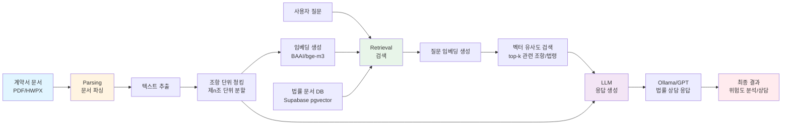
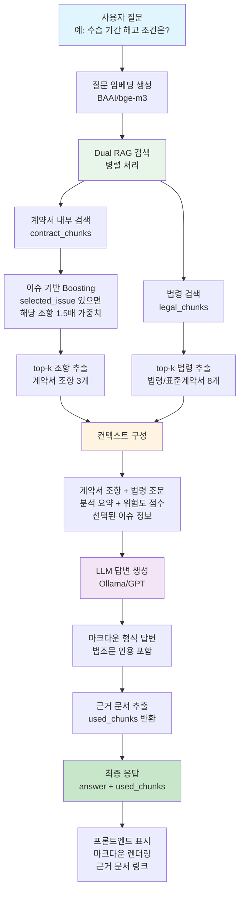
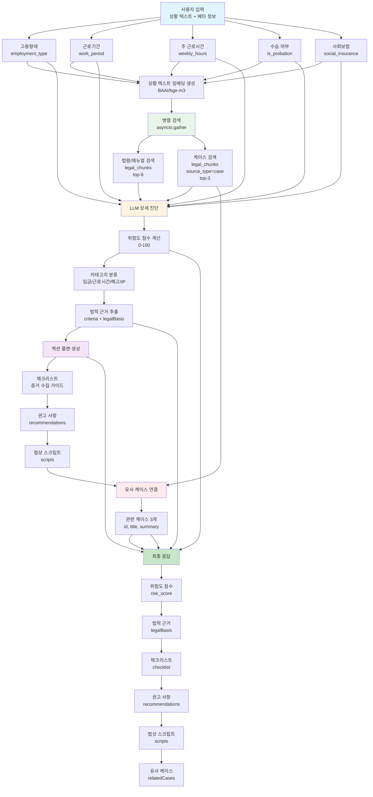
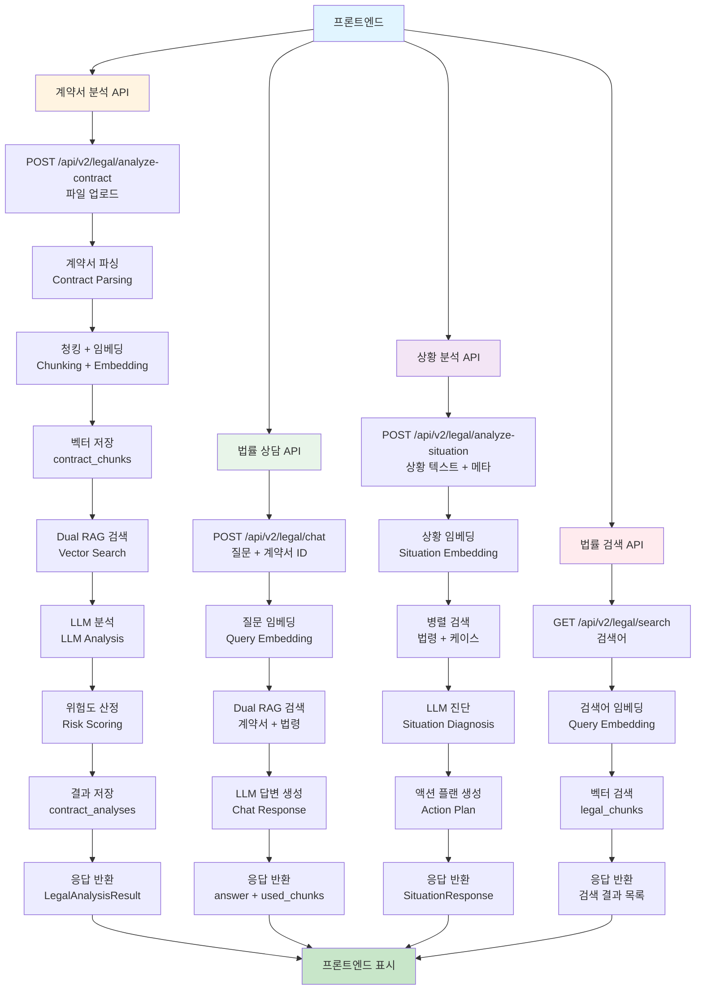

# Linkus Public RAG Backend

## ⚠️ 현재 운영 중인 기능

**법률/계약서 RAG 시스템** - 계약서 분석 및 법률 상담을 위한 RAG 파이프라인

### ✅ 활성 기능
- **계약서 업로드 및 분석**: PDF/HWPX 계약서를 업로드하여 위험도 분석
- **법률 문서 검색**: 근로기준법, 표준계약서, 가이드라인 검색
- **AI 법률 상담**: 계약서 기반 질문에 대한 법률 상담
- **이슈 기반 분석**: 계약서 조항별 위험도 및 개선안 제시

### ⚠️ 레거시 기능 (사용하지 않음)
- 공고 업로드/검색 (`/api/announcements/*`)
- 팀 매칭 (`/api/v2/teams/*`)
- 공고 분석 (`/api/analysis/*`)

**레거시 기능은 더 이상 개발/유지보수되지 않으며, 향후 제거될 예정입니다.**

## 📑 목차

1. [빠른 시작](#-빠른-시작)
2. [새로운 개발자 가이드](#-새로운-개발자-가이드) ⭐
3. [프로젝트 구조](#-프로젝트-구조)
4. [주요 기능](#-주요-기능)
5. [RAG 파이프라인](#-rag-파이프라인)
6. [관련 문서](#-관련-문서)
7. [라이선스](#-라이선스)

---

## 🆕 새로운 개발자 가이드

**GitHub에서 프로젝트를 처음 클론한 새로운 개발자를 위한 가이드입니다.**

> ⚠️ **중요**: 임베딩 모델과 청킹 작업은 **이미 완료되어 DB에 저장되어 있습니다**.
> 
> 새로운 개발자는 **추가로 임베딩 생성이나 청킹 작업을 할 필요가 없습니다!**
> 
> 단순히 환경 설정 후 API만 사용하면 됩니다.

**👉 [새로운 개발자 가이드 보기](./README_NEW_DEVELOPER.md)**

### 빠른 요약

1. ✅ **이미 완료됨**: 임베딩 모델 설정, 청킹, DB 저장
2. 🔧 **해야 할 일**: 환경 설정 (`.env` 파일), 의존성 설치, 서버 실행
3. 🚀 **바로 사용 가능**: API 엔드포인트 사용

---

## 🚀 빠른 시작

### 1. 환경 설정

#### Python 버전 확인
Python 3.9 이상이 필요합니다:
```bash
python --version
```

#### 가상환경 생성 및 활성화

**Windows:**
```bash
cd backend
python -m venv venv
venv\Scripts\activate
```

**Linux/Mac:**
```bash
cd backend
python -m venv venv
source venv/bin/activate
```

#### 의존성 설치
```bash
pip install -r requirements.txt
```

### 2. 환경 변수 설정

프로젝트 루트(`backend/`)에 `.env` 파일을 생성하고 다음 내용을 추가하세요:

```env
# Supabase 설정 (필수)
SUPABASE_URL=your_supabase_url
SUPABASE_SERVICE_ROLE_KEY=your_service_role_key
DATABASE_URL=your_database_url

# OpenAI API (선택, Ollama 사용 시 불필요)
OPENAI_API_KEY=your_openai_api_key_here

# Ollama 설정 (로컬 LLM 사용, 기본값)
OLLAMA_BASE_URL=http://localhost:11434
OLLAMA_MODEL=llama3
USE_OLLAMA=true

# Embedding Model (법률/계약서 전용, 기본값: BAAI/bge-m3)
# 법률 문서는 다국어 지원 모델 사용 권장
LOCAL_EMBEDDING_MODEL=BAAI/bge-m3
USE_LOCAL_EMBEDDING=true

# Embedding Device (선택, 기본값: 자동 감지)
# "cuda": GPU 강제 사용 (GPU가 있는 경우)
# "cpu": CPU 강제 사용 (GPU가 없거나 CPU만 사용하고 싶은 경우)
# 설정하지 않으면 자동으로 GPU/CPU 감지
EMBEDDING_DEVICE=cuda  # 또는 cpu, 또는 주석 처리 (자동 감지)

# LLM Model (선택, 기본값: gpt-4o-mini)
LLM_MODEL=gpt-4o-mini
LLM_TEMPERATURE=0.1

# Chunk Settings (법률/계약서 전용)
# 계약서는 조항 단위로 청킹되므로, 이 값은 조항 내부 문단 분할에 사용됨
CHUNK_SIZE=1500  # 조항 내부 문단 분할 시 사용
CHUNK_OVERLAP=300  # 조항 내부 문단 오버랩

# Server Settings (선택)
HOST=0.0.0.0
PORT=8000

# Logging Settings (선택)
LOG_LEVEL=INFO  # INFO, DEBUG, WARNING, ERROR
```

**중요:** 
- Supabase 설정은 필수입니다 (`SUPABASE_URL`, `SUPABASE_SERVICE_ROLE_KEY`)
- 로컬 LLM 사용 시 Ollama가 설치되어 있어야 합니다
- 로깅 레벨은 `LOG_LEVEL` 환경 변수로 제어할 수 있습니다

### 3. 서버 실행

#### 방법 1: Python 직접 실행
```bash
python main.py
```

#### 방법 2: 실행 스크립트 사용

**Windows:**
```bash
run.bat
```

**Linux/Mac:**
```bash
chmod +x run.sh
./run.sh
```

#### 방법 3: Uvicorn 직접 실행
```bash
uvicorn main:app --host 0.0.0.0 --port 8000 --reload
```

### 4. 서버 확인

서버가 정상적으로 실행되면 다음 URL에서 확인할 수 있습니다:

- **API 문서 (Swagger UI)**: http://localhost:8000/docs
- **ReDoc 문서**: http://localhost:8000/redoc
- **헬스 체크**: http://localhost:8000/api/health
- **루트 엔드포인트**: http://localhost:8000/

### 5. 실행 확인

터미널에서 다음 명령어로 서버 상태를 확인하세요:

```bash
# 헬스 체크
curl http://localhost:8000/api/health

# 또는 브라우저에서
# http://localhost:8000/api/health 접속
```

정상 응답 예시:
```json
{
  "status": "ok",
  "message": "Linkus Public RAG API is running"
}
```

---

## 📁 프로젝트 구조

```
backend/
├── main.py                 # FastAPI 메인
├── config.py               # 설정
├── requirements.txt
│
├── core/
│   ├── exceptions.py          # 커스텀 예외 클래스
│   ├── error_handler.py      # 공통 에러 핸들러
│   ├── logging_config.py     # 로깅 설정 통합
│   ├── dependencies.py       # 의존성 주입 패턴
│   ├── document_processor_v2.py  # 문서 처리 (조항 단위 청킹)
│   ├── supabase_vector_store.py   # 벡터 DB (Supabase)
│   ├── generator_v2.py       # LLM 생성
│   ├── orchestrator_v2.py    # RAG 통합 (레거시)
│   ├── legal_rag_service.py  # 법률 RAG 서비스 (Dual RAG)
│   ├── contract_storage.py   # 계약서 저장 서비스
│   ├── prompts.py            # LLM 프롬프트 템플릿
│   ├── async_tasks.py        # 비동기 작업 관리
│   └── tools/                # 계약서 분석 도구들
│
├── models/
│   └── schemas.py              # Pydantic 모델
│
├── api/
│   ├── routes_v2.py          # 공고 RAG API 엔드포인트
│   ├── routes_legal.py       # 법률 RAG API (v1)
│   └── routes_legal_v2.py    # 법률 RAG API (v2)
│
└── data/
    ├── chroma_db/              # 벡터 DB 저장소 (레거시)
    ├── temp/                   # 임시 파일
    └── legal/                  # 법률 문서 데이터
```

---

## 🔌 API 엔드포인트

API 엔드포인트에 대한 상세 설명은 [API_REFERENCE.md](./API_REFERENCE.md)를 참고하세요.

### ✅ 현재 활성 엔드포인트 (법률/계약서 RAG)

**계약서 분석:**
- `POST /api/v2/legal/analyze-contract` - 계약서 업로드 및 분석
- `GET /api/v2/legal/contracts/{doc_id}` - 계약서 분석 결과 조회
- `GET /api/v2/legal/contracts/history` - 계약서 히스토리 조회

**법률 검색:**
- `GET /api/v2/legal/search` - 법률 문서 검색 (근로기준법, 표준계약서 등)

**법률 상담:**
- `POST /api/v2/legal/chat` - 계약서 기반 AI 법률 상담
- `POST /api/v2/legal/analyze-situation` - 상황 분석

### ⚠️ 레거시 엔드포인트 (사용하지 않음)

**공고 관련 (deprecated):**
- `POST /api/announcements/upload` - 공고 업로드 (레거시)
- `GET /api/v2/announcements/search` - 공고 검색 (레거시)
- `GET /api/announcements/{announcement_id}/analysis` - 공고 분석 (레거시)

**팀 매칭 (deprecated):**
- `POST /api/v2/teams/embedding` - 팀 임베딩 저장 (레거시)
- `GET /api/v2/teams/search` - 팀 검색 (레거시)
- `GET /api/v2/announcements/{announcement_id}/match-teams` - 팀 매칭 (레거시)

**API 문서:** http://localhost:8000/docs

---

## 🧪 테스트

테스트 방법 및 예제는 [TESTING.md](./TESTING.md)를 참고하세요.

**빠른 테스트:**
- Swagger UI: http://localhost:8000/docs
- 헬스 체크: `curl http://localhost:8000/api/health`

## 📦 법률 파일 관리 스크립트

### 0. OCR 테스트 (`test_ocr.py`)

이미지 기반 PDF의 OCR 처리 테스트:

```bash
cd backend
python scripts/test_ocr.py "파일명.pdf"

# 강제 OCR 모드
python scripts/test_ocr.py "파일명.pdf" --force-ocr

# 출력 파일 지정
python scripts/test_ocr.py "파일명.pdf" -o "output.txt"
```

**기능:**
- 텍스트 추출 결과 미리보기
- 통계 정보 (문자 수, 숫자, 한글, 영문)
- 추출된 텍스트를 파일로 저장

### 1. 파일 인덱싱 (`index_contracts_from_data.py`)

법률 파일을 `legal_chunks` 테이블에 인덱싱합니다.

**기본 사용법 (모든 파일):**
```bash
cd backend
python scripts/index_contracts_from_data.py
```

**특정 파일만 인덱싱:**
```bash
# 단일 파일
python scripts/index_contracts_from_data.py --files "개정 표준취업규칙(2025년, 배포).pdf"

# 여러 파일
python scripts/index_contracts_from_data.py --files "파일1.pdf" "파일2.pdf"

# 패턴으로 필터링
python scripts/index_contracts_from_data.py --pattern "*표준계약서*.pdf"

# 특정 폴더만
python scripts/index_contracts_from_data.py --folder standard_contracts

# Storage 업로드 포함
python scripts/index_contracts_from_data.py --files "파일명.pdf" --upload-to-storage
```

**옵션:**
- `--files`: 특정 파일명 지정 (여러 개 가능)
- `--pattern`: 파일명 패턴으로 필터링 (glob 패턴)
- `--folder`: 특정 폴더만 처리 (`standard_contracts`, `laws`, `manuals`, `cases`)
- `--upload-to-storage`: Supabase Storage에 파일 업로드

**OCR 자동 활용:**
- 이미지 기반 PDF 자동 감지 및 OCR 전환
  - 텍스트 추출 실패 시 자동으로 OCR로 전환
  - 텍스트가 50자 미만이거나 의미 없는 경우 이미지 기반으로 판단하여 OCR 사용
  - OCR 결과가 더 우수하면 자동으로 채택
- 별도 설정 불필요: Tesseract와 Poppler이 설치되어 있으면 자동으로 활용
- 한국어 지원: Tesseract 한국어 언어 팩 자동 감지 및 사용

### 2. 파일 목록 확인 (`check_legal_files.py`)

`legal_chunks` 테이블에 저장된 파일 목록을 확인합니다.

```bash
cd backend
python scripts/check_legal_files.py
```

**확인 내용:**
- source_type별 파일 수 및 청크 수 통계
- external_id 패턴 분석 (MD5 해시 vs 파일명)
- 각 파일의 file_path, metadata.filename 정보
- external_id 없는 청크 수

### 3. Storage 업로드 (`upload_legal_files_to_storage.py`)

기존 `legal_chunks` 데이터의 원본 파일을 Supabase Storage에 업로드합니다.

**사용 순서:**
```bash
# 1단계: 파일 목록 확인
cd backend
python scripts/check_legal_files.py

# 2단계: Storage에 업로드
python scripts/upload_legal_files_to_storage.py
```

**기능:**
- `legal_chunks` 테이블에서 파일 정보 조회
- `backend/data/legal/` 폴더에서 원본 파일 찾기
- Supabase Storage `legal-sources` 버킷에 업로드
- DB의 `file_path` 컬럼 업데이트
- 결과를 JSON 파일로 저장 (`backend/output/legal_files_upload_result_*.json`)

**파일 찾기 우선순위:**
1. DB에 저장된 `file_path` 사용
2. `metadata.filename` 사용
3. `title`로 직접 찾기 + 해시 확인
4. 모든 파일 순회하며 해시 확인

**주의사항:**
- `legal-sources` 버킷이 존재해야 합니다
- 로컬 파일이 `backend/data/legal/` 폴더에 있어야 합니다
- Windows 경로 구분자(`\`) 자동 처리

### 성능 테스트

RAG 시스템의 성능을 측정하는 스크립트:

```bash
cd backend
python scripts/performance_test.py
```

**측정 항목:**
- 단일/배치 임베딩 생성 성능
- 임베딩 캐시 효과
- 벡터 검색 성능
- LLM 응답 생성 성능
- Dual RAG 검색 성능
- 전체 계약서 분석 파이프라인
- 비동기 병렬 처리 효과

**결과 저장:**
- 테스트 결과는 자동으로 `backend/data/indexed/reports/performance/` 폴더에 JSON 형식으로 저장됩니다
- 파일명: `performance_test_YYYYMMDD_HHMMSS.json`
- 각 테스트 완료 시마다 결과가 저장되므로, 중간에 중단되어도 완료된 테스트 결과는 보존됩니다

상세한 사용법은 [scripts/README_PERFORMANCE_TEST.md](./scripts/README_PERFORMANCE_TEST.md)를 참고하세요.

---

## 🔧 설정

환경 변수 및 설정에 대한 상세 설명은 [CONFIGURATION.md](./CONFIGURATION.md)를 참고하세요.

**필수 설정:**
- `SUPABASE_URL`, `SUPABASE_SERVICE_ROLE_KEY`, `DATABASE_URL`

**주요 설정:**
- **LLM 설정**: [LLM_SETUP.md](./LLM_SETUP.md) - Groq/Ollama 선택 및 설정 가이드
  - 계약서 분석, 법률 상담, 상황분석에서 모두 사용
  - 환경변수 `LLM_PROVIDER`로 Groq/Ollama 전환 가능
- 임베딩 설정
- 청크 설정
- 서버 설정
- 로깅 설정

---

## 📝 주요 기능

### ✅ 현재 활성 기능 (법률/계약서 RAG)

1. **계약서 처리**: PDF/HWPX 계약서 업로드 및 텍스트 추출
2. **조항 단위 청킹**: 계약서를 조항(제n조) 단위로 분할하여 분석
3. **법률 문서 벡터 저장**: Supabase pgvector를 사용한 법률 문서 임베딩 저장
4. **법률 문서 검색**: 벡터 유사도 기반 법령/표준계약서 검색
5. **계약서 위험도 분석**: LLM을 사용한 계약서 위험도 분석 및 조항 검토
6. **이슈 기반 분석**: 계약서 조항별 위험 이슈 식별 및 개선안 제시
7. **AI 법률 상담**: 계약서 기반 질문에 대한 법률 상담 (RAG 기반)
8. **계약서 히스토리 관리**: 분석 결과 자동 저장 및 조회
   - 분석 완료 시 자동으로 DB에 저장
   - 사용자별 히스토리 조회 지원
   - 프론트엔드에서 로컬 스토리지 fallback 지원
9. **공통 에러 핸들러**: 일관된 에러 응답 형식
10. **로깅 통합**: 중앙화된 로깅 설정 및 파일 로테이션
11. **의존성 주입**: 싱글톤 패턴 기반 서비스 관리

### ⚠️ 레거시 기능 (사용하지 않음)

- 공고 업로드/검색
- 팀 매칭
- 공고 분석

## 🔄 RAG 파이프라인

법률/계약서 RAG 시스템은 다음과 같은 파이프라인으로 동작합니다:



### 파이프라인 단계 설명

1. **Parsing (문서 파싱)**
   - PDF/HWPX 파일에서 텍스트 추출
   - 계약서를 조항(제n조) 단위로 청킹
   - 각 조항을 임베딩 벡터로 변환 (BAAI/bge-m3 모델)

2. **Retrieval (검색)**
   - 사용자 질문을 임베딩 벡터로 변환
   - Supabase pgvector를 사용하여 유사한 법률 문서/조항 검색
   - 계약서 조항과 법령을 병렬로 검색 (Dual RAG)

3. **LLM (응답 생성)**
   - 검색된 관련 문서와 계약서 조항을 컨텍스트로 제공
   - Ollama 또는 OpenAI LLM을 사용하여 법률 상담 응답 생성
   - 계약서 위험도 분석 및 개선안 제시

### [그림 5-2-2] 계약서 분석 전체 흐름도

계약서 분석의 전체 파이프라인은 다음과 같은 단계로 구성됩니다:

```mermaid
flowchart TD
    A[계약서 파일<br/>PDF/HWPX] --> B[Contract Parsing<br/>계약서 파싱]
    B --> B1[텍스트 추출<br/>OCR/파서]
    B1 --> C[Chunking<br/>청킹]
    C --> C1[조항 단위 분할<br/>제n조 단위]
    C1 --> C2[메타데이터 추출<br/>article_number, category]
    
    C2 --> D[Embedding<br/>임베딩 생성]
    D --> D1[BAAI/bge-m3 모델<br/>1024차원 벡터]
    D1 --> D2[벡터 저장<br/>contract_chunks 테이블]
    
    D2 --> E[Vector Search<br/>벡터 검색]
    E --> E1[Dual RAG 검색]
    E1 --> E2[계약서 내부 검색<br/>contract_chunks]
    E1 --> E3[법령 검색<br/>legal_chunks]
    E2 --> E4[유사도 기반<br/>top-k 조항/법령]
    E3 --> E4
    
    E4 --> F[RAG Augmentation<br/>RAG 증강]
    F --> F1[컨텍스트 구성<br/>계약서 조항 + 법령 조문]
    F1 --> F2[관련 문서 묶음<br/>grounding chunks]
    
    F2 --> G[LLM Analysis<br/>LLM 분석]
    G --> G1[위험 조항 식별<br/>이슈 탐지]
    G1 --> G2[자연어 설명 생성<br/>위험 사유 분석]
    G2 --> G3[법조문 인용<br/>근거 문서 추출]
    
    G3 --> H[Risk Scoring<br/>위험도 산정]
    H --> H1[조항별 위험도 계산<br/>0-100 점수]
    H1 --> H2[카테고리별 가중치<br/>임금/근로시간/해고/IP]
    H2 --> H3[전체 위험도 스코어<br/>가중 평균]
    
    H3 --> I[Highlight Mapping<br/>하이라이트 매핑]
    I --> I1[위험 조항 위치 매핑<br/>article_number 매칭]
    I1 --> I2[원문 하이라이트<br/>위험 구간 표시]
    I2 --> I3[수정 제안 매핑<br/>개선안 연결]
    
    I3 --> J[최종 결과<br/>분석 완료]
    J --> J1[위험도 점수<br/>이슈 목록]
    J1 --> J2[하이라이트된 계약서<br/>위험 구간 표시]
    J2 --> J3[개선 제안<br/>수정 문구]
    
    style A fill:#e1f5ff
    style B fill:#fff4e1
    style C fill:#fff4e1
    style D fill:#e8f5e9
    style E fill:#e8f5e9
    style F fill:#f3e5f5
    style G fill:#f3e5f5
    style H fill:#ffebee
    style I fill:#ffebee
    style J fill:#c8e6c9
```



#### 흐름도 단계별 상세 설명

1. **Contract Parsing (계약서 파싱)**
   - PDF/HWPX 파일에서 텍스트 추출 (PyMuPDF, pdfplumber, pytesseract)
   - OCR을 통한 이미지 기반 텍스트 인식
   - 문서 구조 분석 및 메타데이터 추출

2. **Chunking (청킹)**
   - 계약서를 조항(제n조) 단위로 자동 분할
   - 조항 번호 패턴 분석 (제n조, 제n장, 제n절 등)
   - 각 조항에 메타데이터 부여 (article_number, category 등)
   - 긴 조항은 문단 단위로 추가 분할

3. **Embedding (임베딩 생성)**
   - BAAI/bge-m3 모델을 사용하여 각 청크를 1024차원 벡터로 변환
   - 법률/계약서 도메인에 최적화된 다국어 임베딩 모델 사용
   - 생성된 벡터를 Supabase `contract_chunks` 테이블에 저장

4. **Vector Search (벡터 검색)**
   - Dual RAG 검색 수행:
     - **계약서 내부 검색**: `contract_chunks`에서 관련 조항 검색
     - **법령 검색**: `legal_chunks`에서 관련 법령/표준계약서 검색
   - 코사인 유사도 기반 top-k 결과 추출
   - 선택된 이슈가 있으면 해당 조항에 boosting 적용

5. **RAG Augmentation (RAG 증강)**
   - 검색된 계약서 조항과 법령 조문을 컨텍스트로 구성
   - 관련 문서들을 grounding chunks로 묶음
   - 프롬프트에 "근거 없는 내용 생성 금지" 규칙 포함

6. **LLM Analysis (LLM 분석)**
   - Ollama 또는 OpenAI LLM을 사용하여 위험 조항 식별
   - 각 이슈에 대한 자연어 설명 생성 (200-300자)
   - 관련 법령 조문 자동 추출 및 인용
   - 위험 사유 상세 분석

7. **Risk Scoring (위험도 산정)**
   - 조항별 위험도 계산 (0-100 점수)
   - 카테고리별 가중치 적용:
     - 임금: 30%
     - 근로시간: 25%
     - 해고: 25%
     - 지적재산권: 20%
   - 전체 위험도 스코어 산출 (가중 평균)
   - 위험도 레벨 분류 (low/medium/high)

8. **Highlight Mapping (하이라이트 매핑)**
   - 위험 조항의 원문 위치 매핑 (article_number 기반)
   - 계약서 원문에서 위험 구간 하이라이트 표시
   - 각 이슈에 대한 수정 제안 문구 생성 및 연결
   - 프론트엔드에서 시각적으로 표시할 수 있도록 구조화

### [그림 5-2-3] 법률 상담 챗 플로우

계약서 기반 법률 상담 챗의 전체 흐름:



#### 법률 상담 챗 단계별 설명

1. **질문 입력**
   - 사용자가 계약서 관련 질문 입력
   - 선택된 이슈 정보가 있으면 함께 전달

2. **Dual RAG 검색**
   - **계약서 내부 검색**: `contract_chunks`에서 관련 조항 검색
     - 선택된 이슈가 있으면 해당 조항에 1.5배 boosting 적용
     - top-3 조항 추출
   - **법령 검색**: `legal_chunks`에서 관련 법령/표준계약서 검색
     - top-8 법령 추출
   - 병렬 처리로 성능 최적화

3. **컨텍스트 구성**
   - 검색된 계약서 조항과 법령 조문 결합
   - 분석 요약, 위험도 점수, 선택된 이슈 정보 포함
   - 프롬프트에 "근거 없는 내용 생성 금지" 규칙 포함

4. **LLM 답변 생성**
   - Ollama 또는 OpenAI LLM 사용
   - 마크다운 형식으로 구조화된 답변 생성
   - 관련 법조문 자동 인용
   - 사용된 청크 정보 반환 (used_chunks)

5. **응답 반환**
   - 마크다운 형식 답변
   - 근거 문서 목록 (프론트엔드에서 링크 표시)

### [그림 5-2-4] 상황 분석 플로우

텍스트 기반 상황 진단의 전체 흐름:



#### 상황 분석 단계별 설명

1. **사용자 입력**
   - 상황 텍스트 (자유 입력)
   - 메타 정보: 고용형태, 근로기간, 주 근로시간, 수습 여부, 사회보험 등

2. **병렬 검색**
   - **법령/매뉴얼 검색**: `legal_chunks`에서 관련 법령/가이드라인 검색 (top-8)
   - **케이스 검색**: `legal_chunks`에서 유사 케이스 검색 (top-3, source_type=case)
   - 같은 임베딩을 재사용하여 병렬 처리

3. **LLM 상세 진단**
   - 검색된 법령/케이스와 메타 정보를 컨텍스트로 제공
   - 위험도 점수 계산 (0-100)
   - 카테고리별 분류 (임금, 근로시간, 해고, 지적재산권)
   - 법적 근거 추출 (criteria + legalBasis)

4. **액션 플랜 생성**
   - **체크리스트**: 증거 수집 가이드 (첫 번째 step의 items)
   - **권고 사항**: 개선 방안 (나머지 steps의 items)
   - **협상 스크립트**: 회사에 질문할 문구 3개

5. **유사 케이스 연결**
   - 검색된 케이스 3개를 관련 케이스로 연결
   - 케이스 ID, 제목, 요약 정보 제공

6. **최종 응답**
   - 위험도 점수 및 레벨 (low/medium/high)
   - 법적 근거 목록
   - 체크리스트 및 권고 사항
   - 협상 스크립트
   - 유사 케이스 목록

### [그림 5-2-5] API 엔드포인트 플로우

전체 API 호출 흐름:



#### API 엔드포인트별 설명

1. **계약서 분석 API** (`POST /api/v2/legal/analyze-contract`)
   - 파일 업로드 → 파싱 → 청킹 → 임베딩 → 벡터 저장
   - Dual RAG 검색 → LLM 분석 → 위험도 산정
   - 결과를 DB에 저장하고 반환

2. **법률 상담 API** (`POST /api/v2/legal/chat`)
   - 질문 + 계약서 ID 입력
   - Dual RAG 검색 (계약서 내부 + 법령)
   - LLM 답변 생성 및 반환

3. **상황 분석 API** (`POST /api/v2/legal/analyze-situation`)
   - 상황 텍스트 + 메타 정보 입력
   - 병렬 검색 (법령 + 케이스)
   - LLM 진단 및 액션 플랜 생성

4. **법률 검색 API** (`GET /api/v2/legal/search`)
   - 검색어 입력
   - 벡터 검색으로 관련 법령/표준계약서 검색
   - 검색 결과 목록 반환

## 🏗️ 아키텍처

아키텍처 개선 사항에 대한 상세 내용은 [ARCHITECTURE_IMPROVEMENTS.md](./ARCHITECTURE_IMPROVEMENTS.md)를 참고하세요.

**주요 개선 사항:**
- 공통 에러 핸들러
- 로깅 설정 통합
- 의존성 주입 패턴

---

## 🔍 이미지 기반 PDF 처리 (OCR)

### 자동 OCR 처리

시스템은 이미지 기반 PDF를 자동으로 감지하고 OCR을 사용합니다:

1. **자동 감지**: 텍스트 추출이 실패하거나 결과가 너무 짧으면 자동으로 OCR로 전환
2. **한국어 지원**: Tesseract 한국어 언어 팩 자동 감지 및 사용
3. **고품질 OCR**: 600 DPI로 변환하여 인식률 향상

### OCR 설정 방법

#### 1. Python 패키지 설치

```bash
pip install pytesseract pdf2image
```

#### 2. Tesseract OCR 설치

**Windows:**
1. [Tesseract OCR Windows 설치](https://github.com/tesseract-ocr/tesseract/wiki) 다운로드
2. 설치 시 **"Additional language data"**에서 **"Korean"** 선택 필수
3. 기본 설치 경로: `C:\Program Files\Tesseract-OCR\tesseract.exe`

**Linux (Ubuntu/Debian):**
```bash
sudo apt-get install tesseract-ocr tesseract-ocr-kor
```

**Mac:**
```bash
brew install tesseract tesseract-lang
```

#### 3. Poppler 설치 (Windows, PDF → 이미지 변환용)

**Windows:**
1. [Poppler Windows 릴리스](https://github.com/oschwartz10612/poppler-windows/releases) 다운로드
2. 압축 해제 후 `POPPLER_PATH` 환경 변수 설정:
   ```bash
   set POPPLER_PATH=C:\path\to\poppler\Library\bin
   ```
3. 또는 `Downloads` 폴더에 압축 해제하면 자동 감지

**Linux/Mac:**
```bash
# Ubuntu/Debian
sudo apt-get install poppler-utils

# Mac
brew install poppler
```

### OCR 사용 방법

#### 자동 모드 (권장)

```python
from core.document_processor_v2 import DocumentProcessor

processor = DocumentProcessor()
text = processor.pdf_to_text("image_based.pdf")
# 자동으로 텍스트 추출 실패 시 OCR로 전환
```

#### 강제 OCR 모드

```python
# 무조건 OCR만 사용
text = processor.pdf_to_text("image_based.pdf", force_ocr=True)
```

#### OCR 우선 모드

```python
# 텍스트 추출 성공해도 OCR 품질이 더 좋으면 OCR 사용
text = processor.pdf_to_text("image_based.pdf", prefer_ocr=True)
```

### 이미지 기반 PDF 판별 방법

**수동 확인:**
1. PDF 뷰어에서 텍스트 드래그 시도
   - 드래그 안 됨 → 이미지 기반
   - 드래그 됨 → 텍스트 기반

**자동 감지:**
- 시스템이 자동으로 감지하여 OCR로 전환
- 텍스트 추출 결과가 50자 미만이거나 의미없으면 자동 OCR

### OCR 품질 향상 팁

1. **DPI 설정**: 기본값 600 DPI (이미 최적화됨)
2. **한국어 언어 팩**: 반드시 설치 필요
3. **이미지 전처리**: 자동으로 그레이스케일 변환 및 대비 조정

### 고급 OCR 옵션 (구조화된 데이터)

표나 레이아웃 구조가 필요한 경우:

- **AWS Textract**: 표 인식 우수, 비용 발생
- **Google Cloud Vision**: 문서 OCR, 레이아웃 인식
- **Naver CLOVA OCR**: 한글 인식률 우수

현재는 Tesseract OCR을 사용하며, 향후 상용 OCR API 연동 가능.

## 🚨 문제 해결

문제 해결 가이드는 [TROUBLESHOOTING.md](./TROUBLESHOOTING.md)를 참고하세요.

### 🔧 로컬 임베딩 생성 실패

**"로컬 임베딩 생성 실패" 오류가 발생하는 경우:**

1. **진단 스크립트 실행:**
   ```bash
   cd backend
   python test_embedding.py
   ```

2. **상세 해결 가이드:**
   - [TROUBLESHOOTING_EMBEDDING.md](./TROUBLESHOOTING_EMBEDDING.md) 참고

**빠른 해결 방법:**
- Windows: Long Path 활성화 후 재시작 → `pip install sentence-transformers`
- PyTorch 오류: `pip uninstall torch && pip install torch`
- 모델 다운로드 실패: 인터넷 연결 확인

**일반적인 문제:**
- 서버 시작 오류
- 의존성 설치 오류
- ChromaDB 관련 문제
- OpenAI API 관련 문제
- PDF 처리 관련 문제

### 임베딩 모델 관련 문제

#### PyTorch 메타 텐서 오류 (`Cannot copy out of meta tensor`)
**증상:**
```
NotImplementedError: Cannot copy out of meta tensor; no data! 
Please use torch.nn.Module.to_empty() instead of torch.nn.Module.to() 
when moving module from meta to a different device.
```

**원인:**
- PyTorch 버전 호환성 문제
- sentence-transformers 모델 로딩 시 디바이스 이동 문제

**해결 방법:**
1. **PyTorch 재설치:**
   ```bash
   pip uninstall torch torchvision torchaudio
   pip install torch torchvision torchaudio --index-url https://download.pytorch.org/whl/cpu
   ```

2. **sentence-transformers 재설치:**
   ```bash
   pip uninstall sentence-transformers
   pip install sentence-transformers
   ```

3. **환경 변수 설정 (Windows):**
   ```bash
   set PYTORCH_ENABLE_MPS_FALLBACK=1
   ```

4. **모델 캐시 삭제 후 재다운로드:**
   ```bash
   # Windows
   rmdir /s "%USERPROFILE%\.cache\huggingface"
   
   # Linux/Mac
   rm -rf ~/.cache/huggingface
   ```

#### 임베딩 생성 속도 문제
**증상:**
- 임베딩 생성이 매우 느림 (CPU 모드)

**원인:**
- `BAAI/bge-m3` 모델은 큰 모델(568MB)이라 CPU에서 실행 시 느림
- 배치 크기가 작음

**해결 방법:**
1. **GPU 사용 (권장):**
   - CUDA 지원 GPU가 있으면 자동으로 사용
   - 또는 환경 변수로 강제 지정: `EMBEDDING_DEVICE=cuda`
   - PyTorch CUDA 버전 설치:
     ```bash
     pip install torch torchvision torchaudio --index-url https://download.pytorch.org/whl/cu118
     ```

2. **배치 크기 최적화 (이미 적용됨):**
   - `generator_v2.py`에서 `batch_size=64`로 설정
   - `show_progress_bar=True`로 진행 상황 표시

3. **더 작은 모델 사용 (품질 저하 가능):**
   - 환경 변수에서 `LOCAL_EMBEDDING_MODEL=BAAI/bge-small-en-v1.5` 설정
   - 주의: 384차원으로 변경되므로 DB 스키마도 변경 필요

#### 디바이스 설정 (GPU/CPU 선택)
**환경 변수로 디바이스 강제 지정:**

```env
# GPU 강제 사용 (GPU가 있는 경우)
EMBEDDING_DEVICE=cuda

# CPU 강제 사용 (GPU가 없거나 CPU만 사용하고 싶은 경우)
EMBEDDING_DEVICE=cpu

# 자동 감지 (기본값, 설정하지 않으면 자동)
# EMBEDDING_DEVICE 설정 안 함
```

**사용 시나리오:**
- **GPU가 있는 개발자**: `EMBEDDING_DEVICE=cuda` 설정 (또는 자동 감지)
- **CPU만 있는 개발자**: `EMBEDDING_DEVICE=cpu` 설정
- **자동 감지**: 환경 변수 설정 안 함 (기본 동작)

#### 임베딩 차원 불일치 오류
**증상:**
```
expected 384 dimensions, not 1024
```

**원인:**
- `BAAI/bge-m3`는 1024차원, `BAAI/bge-small-en-v1.5`는 384차원
- DB 스키마와 모델 차원이 불일치

**해결 방법:**
1. **DB 스키마 업데이트 (1024차원으로 변경):**
   ```sql
   -- Supabase SQL Editor에서 실행
   ALTER TABLE public.legal_chunks 
   DROP COLUMN IF EXISTS embedding;
   
   ALTER TABLE public.legal_chunks 
   ADD COLUMN embedding vector(1024);
   ```

2. **또는 모델을 384차원 모델로 변경:**
   - 환경 변수: `LOCAL_EMBEDDING_MODEL=BAAI/bge-small-en-v1.5`
   - 기존 1024차원 데이터는 삭제 후 재처리 필요

---

## 📚 관련 문서

### 핵심 문서
- [API_REFERENCE.md](./API_REFERENCE.md) - API 엔드포인트 상세 설명
- [TESTING.md](./TESTING.md) - 테스트 방법 및 예제
- [CONFIGURATION.md](./CONFIGURATION.md) - 환경 변수 및 설정 가이드
- [LLM_SETUP.md](./LLM_SETUP.md) - LLM Provider 선택 및 설정 가이드 (Groq/Ollama)
- [TROUBLESHOOTING.md](./TROUBLESHOOTING.md) - 문제 해결 가이드

### 스크립트 문서
- [scripts/README.md](./scripts/README.md) - 배치 인입 스크립트 가이드
- [scripts/README_PERFORMANCE_TEST.md](./scripts/README_PERFORMANCE_TEST.md) - 성능 테스트 스크립트 가이드

### 법률 파일 관리 스크립트
- `scripts/index_contracts_from_data.py` - 법률 파일 인덱싱 (특정 파일 선택 가능)
- `scripts/check_legal_files.py` - legal_chunks 테이블 파일 목록 확인
- `scripts/upload_legal_files_to_storage.py` - legal_chunks 파일을 Storage에 업로드

### 아키텍처 및 로직 문서
- [BACKEND_LOGIC_EXPLANATION.md](./BACKEND_LOGIC_EXPLANATION.md) - 백엔드 로직 상세 설명 (청킹, RAG, 검색)
- [ARCHITECTURE_IMPROVEMENTS.md](./ARCHITECTURE_IMPROVEMENTS.md) - 아키텍처 개선 사항
- [BACKEND_LOGIC_CLEANUP.md](./BACKEND_LOGIC_CLEANUP.md) - 백엔드 로직 정리 보고서
- [core/SITUATION_WORKFLOW_README.md](./core/SITUATION_WORKFLOW_README.md) - 상황분석 LangGraph 워크플로우 가이드

---

## 📄 라이선스

MIT License

