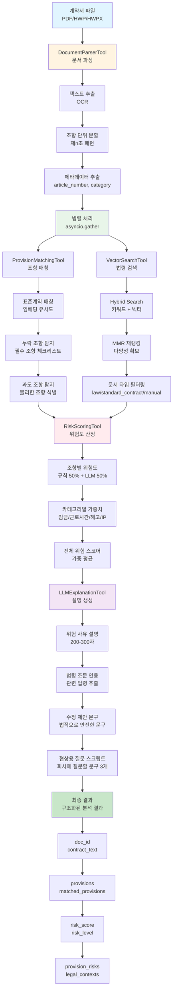

# 계약서 분석 도구 모듈

Phase 1 & Phase 2 구현 완료

## 📁 파일 구조

```
backend/core/tools/
├── __init__.py                  # 모듈 초기화
├── base_tool.py                 # BaseTool 추상 클래스
├── document_parser_tool.py       # 문서 파싱 도구 (Phase 1)
├── vector_search_tool.py         # 벡터 검색 도구 (Phase 1)
├── provision_matching_tool.py    # 조항 매칭 도구 (Phase 2)
├── risk_scoring_tool.py          # 위험도 산정 도구 (Phase 2)
├── example_usage.py              # 사용 예시
└── README.md                     # 이 문서
```

## 🛠️ 구현된 도구

### Phase 1: 기본 도구

#### 1. DocumentParserTool ✅

**기능**:
- ✅ OCR (PyMuPDF, pdfplumber, pytesseract)
- ✅ 조항 단위 청킹 (제n조 패턴 분석)
- ✅ 조항 번호/패턴 분석
- ✅ 메타데이터 추출

**사용 예시**:
```python
from core.tools import DocumentParserTool

tool = DocumentParserTool()
result = await tool.parse(
    file_path="contract.pdf",
    file_type="pdf",
    extract_provisions=True
)

print(f"조항 개수: {len(result['provisions'])}개")
```

#### 2. VectorSearchTool ✅

**기능**:
- ✅ 벡터 검색 (의미 기반)
- ✅ Hybrid Search (키워드 + 벡터)
- ✅ MMR 재랭킹 (다양성 확보)
- ✅ 문서 타입별 필터링

**사용 예시**:
```python
from core.tools import VectorSearchTool

tool = VectorSearchTool()

# Hybrid Search + MMR
result = await tool.search(
    query="수습 기간 해고 조건",
    doc_types=["law", "manual"],
    top_k=5,
    use_hybrid=True,
    use_mmr=True
)
```

### Phase 2: 매칭 및 위험도 산정

#### 3. ProvisionMatchingTool ✅

**기능**:
- ✅ 표준 계약서와 의미 기반 매칭 (임베딩 유사도)
- ✅ 누락 조항 탐지 (필수 조항 체크리스트)
- ✅ 과도 조항 탐지 (불필요한 조항 식별)
- ✅ 매칭 점수 계산

**사용 예시**:
```python
from core.tools import ProvisionMatchingTool

tool = ProvisionMatchingTool()
result = await tool.match(
    contract_text=extracted_text,
    contract_provisions=provisions,
    standard_contract_type="employment"
)

print(f"매칭된 조항: {len(result['matched_provisions'])}개")
print(f"누락된 조항: {len(result['missing_provisions'])}개")
print(f"과도한 조항: {len(result['excessive_provisions'])}개")
```

**출력 형식**:
```python
{
    "matched_provisions": List[MatchedProvision],
    "missing_provisions": List[Dict],  # 누락된 필수 조항
    "excessive_provisions": List[Dict],  # 과도한 조항
    "matching_scores": {
        "total_match_rate": float,
        "average_similarity": float,
        "category_scores": Dict[str, float]
    },
    "summary": str
}
```

#### 4. RiskScoringTool ✅

**기능**:
- ✅ 조항별 위험도 산정 (규칙 기반 + LLM)
- ✅ 전체 위험 스코어 계산 (가중 평균)
- ✅ 영역별 위험도 분류 (근로시간, 임금, 해고 등)
- ✅ 위험도 레벨 분류 (low/medium/high)

**사용 예시**:
```python
from core.tools import RiskScoringTool

tool = RiskScoringTool()
result = await tool.score(
    provisions=provisions,
    matched_provisions=matched_provisions,
    legal_contexts=legal_contexts,
    contract_type="employment",
    use_llm=True
)

print(f"전체 위험도: {result['overall_risk_score']:.1f}점")
print(f"위험 레벨: {result['risk_level']}")
print(f"심각한 이슈: {len(result['critical_issues'])}개")
```

**출력 형식**:
```python
{
    "provision_risks": List[ProvisionRisk],  # 각 조항별 위험도
    "overall_risk_score": float,  # 전체 위험도 (0-100)
    "risk_level": str,  # "low" | "medium" | "high"
    "risk_breakdown": {
        "working_hours": float,
        "wage": float,
        "probation_termination": float,
        "stock_option_ip": float
    },
    "critical_issues": List[str]  # 심각한 이슈 목록
}
```

## 🔄 도구 조합 파이프라인

### 전체 분석 파이프라인 흐름도



### 전체 분석 파이프라인 예시

```python
from core.tools import (
    DocumentParserTool,
    ProvisionMatchingTool,
    VectorSearchTool,
    RiskScoringTool
)

async def analyze_contract_pipeline(file_path: str, contract_type: str):
    # 1. 문서 파싱
    parser = DocumentParserTool()
    parse_result = await parser.parse(file_path, extract_provisions=True)
    
    # 2. 조항 매칭
    matcher = ProvisionMatchingTool()
    match_result = await matcher.match(
        contract_text=parse_result["extracted_text"],
        contract_provisions=parse_result["provisions"],
        standard_contract_type=contract_type
    )
    
    # 3. 법령 검색
    searcher = VectorSearchTool()
    search_result = await searcher.search(
        query=parse_result["extracted_text"][:2000],
        doc_types=["law", "standard_contract", "manual"],
        top_k=10,
        use_hybrid=True,
        use_mmr=True
    )
    
    # 4. 위험도 산정
    scorer = RiskScoringTool()
    risk_result = await scorer.score(
        provisions=parse_result["provisions"],
        matched_provisions=match_result["matched_provisions"],
        legal_contexts=search_result["results"],
        contract_type=contract_type
    )
    
    # 최종 결과
    return {
        "doc_id": parse_result["metadata"]["doc_id"],
        "contract_text": parse_result["extracted_text"],
        "provisions": parse_result["provisions"],
        "matched_provisions": match_result["matched_provisions"],
        "missing_provisions": match_result["missing_provisions"],
        "risk_score": risk_result["overall_risk_score"],
        "risk_level": risk_result["risk_level"],
        "risk_breakdown": risk_result["risk_breakdown"],
        "provision_risks": risk_result["provision_risks"],
        "legal_contexts": search_result["results"]
    }
```

## 📊 데이터 모델

### Provision (조항)
```python
{
    "id": str,
    "title": str,  # "제1조 (목적)"
    "content": str,  # 조항 본문
    "article_number": Optional[int],
    "start_index": int,
    "end_index": int,
    "category": Optional[str]  # "working_hours", "wage" 등
}
```

### MatchedProvision (매칭된 조항)
```python
{
    "provision": Provision,
    "standard_provision": Dict,  # 표준 계약서 조항
    "similarity_score": float,  # 유사도 (0-1)
    "match_type": str  # "exact" | "semantic" | "partial" | "none"
}
```

### ProvisionRisk (조항 위험도)
```python
{
    "provision": Provision,
    "risk_score": float,  # 위험도 (0-100)
    "issue_type": str,  # "missing" | "excessive" | "illegal" | "ambiguous" | "normal"
    "severity": str,  # "low" | "medium" | "high"
    "reasons": List[str]  # 위험 사유
}
```

## 🔍 주요 특징

### ProvisionMatchingTool
- **의미 기반 매칭**: 임베딩 유사도로 표준 계약서와 비교
- **필수 조항 체크리스트**: 계약서 타입별 필수 조항 검증
- **과도 조항 탐지**: 위험 키워드 기반 불리한 조항 식별

### RiskScoringTool
- **하이브리드 점수**: 규칙 기반(50%) + LLM 기반(50%)
- **카테고리별 가중치**: 근로시간(25%), 임금(30%), 해고(25%), IP(20%)
- **위험도 레벨**: low(0-39), medium(40-69), high(70-100)

### Phase 3: LLM 설명 도구

#### 5. LLMExplanationTool ✅

**기능**:
- ✅ 위험 사유 자연어 설명 생성
- ✅ 법령 조문 자동 추출 및 인용
- ✅ 수정 제안 문구 생성
- ✅ 협상용 질문 스크립트 생성

**사용 예시**:
```python
from core.tools import LLMExplanationTool

tool = LLMExplanationTool()
result = await tool.explain(
    provision=provision,
    risk_score=65.0,
    legal_contexts=legal_contexts,
    issue_type="illegal"
)

print(f"설명: {result['explanation']}")
print(f"관련 법령: {result['legal_basis']}")
print(f"수정 제안: {result['suggested_revision']}")
print(f"질문 스크립트: {result['suggested_questions']}")
```

**출력 형식**:
```python
{
    "explanation": str,  # 위험 사유 설명 (200-300자)
    "legal_basis": List[str],  # 관련 법령 조문 (최대 5개)
    "suggested_revision": str,  # 수정 제안 문구
    "rationale": str,  # 수정 이유 (100-150자)
    "suggested_questions": List[str]  # 회사에 질문할 문구 (3개)
}
```

## 🚀 다음 단계

Phase 4에서 구현할 내용:
- `OrchestratorV3` - 전체 파이프라인 통합 및 기존 API 연동

## 📚 참고

- 설계 문서: `backend/CONTRACT_ANALYSIS_TOOLS_DESIGN.md`
- 기존 코드 활용:
  - `DocumentProcessor` (document_processor_v2.py)
  - `LegalChunker` (legal_chunker.py)
  - `SupabaseVectorStore` (supabase_vector_store.py)
  - `LLMGenerator` (generator_v2.py)
