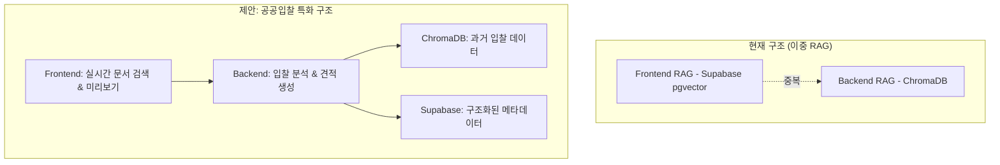

# 현재 문제점과 해결 방안

## 🔴 현재 문제점

### 1. 이중 RAG 구현으로 인한 중복
- Frontend RAG (Supabase pgvector)와 Backend RAG (ChromaDB)가 중복 기능 수행
- 역할 분리 불명확
- 데이터 일관성 문제 가능성

### 2. 성능 이슈
- 실시간 작업과 배치 작업이 혼재
- 사용자 대기 시간 증가
- 리소스 낭비

### 3. 데이터 구조 최적화 부족
- 공공입찰 특화 스키마 부재
- 메타데이터 구조화 부족

## ✅ 해결 방안

### 제안: 공공입찰 특화 구조

## 📋 구현 단계

1. **RAG 역할 명확화** - Frontend/Backend 역할 분리
2. **데이터베이스 스키마 최적화** - 공공입찰 특화 테이블
3. **통합 워크플로우** - 전체 플로우 구현
4. **성능 최적화** - 비동기 처리 및 캐싱
5. **UI/UX 개선** - 실시간 진행 상황 표시

